I had the pleasure of teaching a new class called "Flexible Robotics" while on sabbatical at Bilkent University in Ankara, Turkey this Fall.  The class was a 13 person, senior-level elective course that covered some of the same concepts as my graduate-level "Foldable Robotics" class that I have taught at ASU since 2016, but introduced about 75% new material, based on the needs of undergraduates in their senior year.

> This course could not have been possible without the help and support of Onur Ozcan, who helped me get the course on the books in the first 24 hours I was in the country.  The idea is that he will take on teaching responsibilities for this course at Bilkent in future years.  His advice and guidance on getting the course set up in a different system than I am used to was critical.  Thanks Onur!

## What is _Flexbile Robotics_?

_Flexible Robotics_ is a microcosm of some of the robotics research I do, and teaches a somewhat simplified version of the engineering approaches we use in my lab to design robots.  It focuses on how to design robotic systems that are ultimately limited by the physics of the parts and materials they are constructed with.  To find good designs, we have to know all about soft and flexible materials, motors and how they work, how to model non-ideal components using both first-principles and more realistic representations, and then the best practices for prototyping and validating the performance of our designs.

_Flexible Robotics_ is also a class taught on a budget.  I am of the belief that anyone should have access to robotics concepts, and so I have designed this course to use off-the shelf parts and materials that almost anyone can obtain.  I teach using open-source software tools such as Python, so that anyone can run the code we use on any platform.  And I teach experiment design and data collection using more accessible approaches that I believe **serve as a proxy** for the modern robotics lab.  Not all undergraduates have access to high-speed motion capture systems, but everyone has a cell-phone.  Not every department has a universal testing machine sitting in the student lab, but anyone can make a (relatively) standardized weight.  When we focus on the concepts of how to create good experiments, and the tradeoffs between approaches, the ultimate resolution of the tool matters less.

Here's a summary of the high-level concepts baked into the course:

* I taught with a palette of low-cost parts and tools that are easily obtainable but didn't sacrifice or simplify the associated engineering challenges.
* I provided interactive coding experiences built into class time using Jupyter Notebook and Python.
* I reinforced the kinematics content students should already have had (3D vector operations, rotation matrices, and quaternions), but from a different perspective.
* I added MuJoCo for teaching many concepts in the second half of the course in order to simplify and streamline the number of different tools students had to pick up.
* The course focused on how flexible and compliant materials impact the modeling and design process, and which representations of compliance work best for modeling.
* I used the concepts of biomechanics, specifically terrestrial locomotion, as a way to focus design goals, observe and measure behavior, and talk about performance.

## Course Highlights

Below is a list of the things I focused on when developing this course.

### MuJoCo

</video> <video src="horse.mp4" controls title="Title" width="100%" ></video>   
_Team 3's horse-inspired design_

For the first time, I taught using MuJoCo as a design, modeling, and validation tool instead of my own Python dynamics package that I have previously taught with.  I liked this shift because it made students more aware of the current challenges in simulation using a popular and powerful tool that is easier to learn than my own package.  MuJoCo has much more thorough documentation,  with more examples from the community, so I was not always "on call" supporting my own code.  It also permitted the class to explore the role that contact and friction play at a deeper level than I had been able to take a class before.  On the flip side, the tradeoffs of contact, friction, and "soft solvers" is complex and required more discussion than I gave it, without a satisfying or straightforward "answer" for how to apply it correctly.

### Mechanisms and Kinematics

In contrast to the graduate class I teach, the senior-level _Flexible Robotics_ spends more time reinforcing fundamental concepts in vectors, kinematics, and transformations, but uses the framework of flexible, foldable, and compliant systems to teach from a different perspective.  For example, we defined spherical parallel mechanisms using quaternions instead of rotation matrices or DH parameters, and used the fundamental properties of vectors to define closed-loop constraint equations that we then solved numerically.  Other approaches are often important in foldable systems, where kinematics are often defined from flat-foldable sheets of material rather than from rigid serial chains, and require efficient representations for faster solutions.

## Compliant Materials

It has been difficult introducing compliant material systems, even in the graduate level course I teach, without getting into some complex topics and not feeling like there is enough time to do the topic justice.  In this course, we focused on a few basic concepts of compliant material systems, while  leaving others just to discussion:

<video src="2-elements.mp4" controls title="Title" width="45%"></video> <video src="100-elements.mp4" controls title="Title"  width="45%"></video>  
_Comparison of 2-element pseudo-rigid-body model and 100-element representation_

* **Lumped-parameter models for series and parallel springs and dampers:** refreshing students on this concept permits them to think critically about the impact of making beams longer or shorter, wider or narrower.  It is a useful mental tool, though for cantilever beams under high deformation, simple linear expressions are not the best approximation.  These limitations are discussed.
* **Nonlinear FEA in Solidworks:** We run through an example of running a nonlinear FEA simulation in Solidworks for a beam under high deformation.  We discuss the tradeoffs associated with nonlinear FEA and simulation time.
* **Pseudo-rigid-body models** for cantilever beams: The pseudo-rigid-body-model is a useful tool for engineered shapes in which deformation can be represented more simply (as bending) than for completely soft systems, where FEA is more appropriate.  We compare the behavior of high-deformation cantilever beams modeled with 1,2, 10, 100 joints using MuJoCo and discuss _how_ the optimizer and our error metric impact the parameter fitting process; students then see how the behavior matches against the real-world in a homework assignment, finding the stiffness and damping joint parameters for a selected material they will use in their project.  The benefit of this approach is that **it is completely compatible with our selected dynamics engine**.  The drawback is that you have have some existing knowledge or correctly assume the primary modes of deformation in order to select the right system model.

**What we don't get into.**  We have to leave other topics to just a discussion; I hope to expand on these topics with more offline content.

* **Nonlinear material models.**  It would be nice to have a concrete example of where nonlinear stress/strain models help us estimate behavior.
* **First-principles derivations:**  We don't get into the theory of continuum mechanics, nor do we derive the elliptic curve equations that beams adopt under high deformation.  It would be nice to have time to justify our use of lumped parameter models.
* **Finite Element Theory:**  This would be the most useful topic for a general-purpose soft robotics course, and would go well in this class as well.  Learning a new tool and integrating it with the dynamics of MuJoCo would be difficult.  Perhaps a different simulator would be needed in order to implement this effectively in Flexible Robotics.  I am open to suggestions!

### System Identification and Design Optimization

<video src="../2023-12-07-servo-fitting/servo-fitting.mp4" controls title="Title" width="100%"></video>  
_Servo-fitting example [written up previously](../2023-12-07-servo-fitting/)_

I believe that in general, students need more experience collecting, analyzing, and working with real-world data within the engineering curriculum.  I increased my focus on the use of optimization tools for the purposes of model fitting, parameter identification, and design optimization.  In _Flexible Robotics_, students collected their own real-world data and fit the behavior they observed to the models they developed, primarily using cell-phones for video capture to enable optical motion-tracking.  We used this approach to walk through a full characterization of an RC servo in class, the parameters of which the students could use in their models.  Outside of class, students created their own experiments for measuring the stiffness and damping behaviour of compliant materials serving as the links and joints of their systems, measuring the mass and inertia of their links, and capturing the friction of the surfaces they tested their robots on.  I primarily taught using the scipy.optimize package, which has a number of fundamental optimization algorithms available in the ```scipy.optimize.minimize()``` function.  

### Research Integration

I was lucky enough to join Onur's lab meetings and help contribute to some ongoing research with his students.  Two of Onur's students presented their research to the class.  I believe it was valuable for students to see how graduate researchers are using the same tools and approaches to solving research problems "in real life" from someone other than the professor.  We talked through their current design challenge, some of their design and optimization goals, and they discussed the details of their modeling choices.


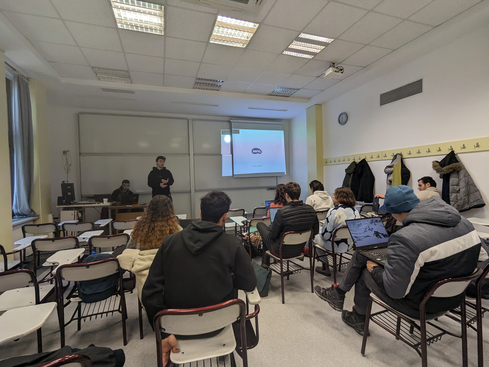

### Parts and Materials

We settled on a list of parts readily available in Turkey.  The cost per student was ~$15. Students who wanted to keep their parts at the end of the semester sourced them themselves; otherwise we loaned sets of parts to students who needed them.  Most students

| Items                             | units | Lira/unit | Subtotal   | Subtotal ($) |
| --------------------------------- | ----- | --------- | ---------- | ------------ |
| Micro Servo                       | 1     | 37.1      | 37.1       | 1.37         |
| Breadboarding wire bundle         | 1     | 49        | 49         | 1.81         |
| 5V Power Supply                   | 1     | 139       | 139        | 5.15         |
| Electrolytic Capacitor, 4700uF    | 1     | 10.23     | 10.23      | 0.38         |
| 6’ USB A to micro cable           | 1     | 30.01     | 30.01      | 1.11         |
| ESP32                             | 1     | 123.69    | 123.69     | 4.58         |
| Photoresistor                     | 2     | 2.73      | 5.46       | 0.2          |
| Half-size breadboard              | 1     | 66        | 66         | 2.44         |
| Resistor matched to photoresistor | 2     | 0         | 0          | 0            |
| **Total**                         |       |           | **394.49** | **14.61**    |

In terms of materials, the Bilkent bookstore was a good source for acetate sheets, which served as a good flexible material that is cheap and easy to work with.  Various kinds of cardboard and posterboard were also available to create rigid elements.

### Course Projects

There were two course projects.  The first project focused on the kinematics and force/torque analysis of a proposed rigid subsystem like a leg, while the second project added compliant material considerations, experiment design and data collection, dynamic modeling, and design optimization at a system level.  Teams of ~4 students contributed their individual kit of parts, so were capable of creating quite complex robots.

I insisted during the second project in meeting with each team to help them focus and trim down the scope of their project.  The timing of this meeting was critical, and I saw dramatic improvements in simulation quality and experimental results.  The project writeups actually seemed more complete because teams were able to more thorougly explore fewer goals.

<video src="hopper.mp4" controls title="Title" width="49%" ></video> <video src="crab.mp4" controls title="Title" width="49%" > 

_Two final project designs, simulated in MuJoCo_

### Exams

To satisfy University requirements, I added a midterm and final exam to the course.  Typically I have lumped more points into assignments and projects, but this helped get the course accepted by the provost on the first pass.  It also required that I spend more class time focusing on fundamentals, but in the end I believe this was time well spent.

## Reflections

Below are a short list of things I might do differently or improve upon in future iterations of the course.

### Kinematics

In terms of solving closed-loop kinematics, estimating forces and torques, and solving the forward or inverse solution to the motion paths created by a mechanism, I provided multiple pathways:

* Solving for the configuration of a rigid mechanism (a triangle) using vector operations like length constraints to find the triangle that satisfied a prescribed set of edge lengths.
* An extension of this toward a four-bar linkage, with numerical Jacobian calculations.
* An example of determining a Jacobian symbolically using the sympy package.
* A homework example that asked students to represent spherical kinematics using quaternions and constraints using vector operations.

However, the variety of examples and approaches seemed to confuse students rather than clarify the concepts of kinematics.  In the future, I think more offline examples of each would help.  Focusing on one or two "preferred" approaches might eliminate some of the confusion, but I also worry this would prevent students from knowing which approaches to select in a different context.

### More Introductory Concepts on the Computational Side

I introduced the mechanics of _using_ MuJoCo before explaining how modern simulators work or some of the many tradeoffs each one makes in its design.  This meant that students only started understanding these tradeoffs later in the semester as they began encountering issues with contact and friction.  That can be ok, but some of the feedback I heard from students was that they would have liked to learn more how simulation works first.  I think this would be a valuable addition.

The same can be said for the topic of optimization.  Though it is a gigantic topic, more could have been discussed in class about the types of optimization categories there are, some of the most popular algorithms in each category, and the tradeoffs and considerations you need to employ in selecting one.  I believe this would have been valuable, especially with more time in the semester.  However, optimization approaches change quickly, and is likely to already be stale if I am teaching it.  I believe it is within an engineer's domain to know how to pick, design, and implement a good approach to solving a given problem, but I believe that in this class that knowledge should be general rather than specific, so that students can adapt what they learn to whatever the popular approach of the day is in the future.

That being said, I think one lecture devoted to optimizing with reinforcement learning or neural networks vs ```fmin()``` would be a valuable addition.

### Prototyping vs Manufacturing

Based on the availability of the tools and my limited familiarity with the school's facilities, _Flexible Robotics_ focused more on manual prototyping approaches than digital manufacturing techniques supported by computational planning approaches.  While it would have been nice to devote more time to this topic, other things took more priority.  By the end of the course, I was cutting material, and it made more sense to remove this module than to take time away from more fundamental concepts.

### In-class coding

In previous classes I have taught, I have used time in class to explain code as the students and I write code together.  Students ask questions as they follow me, and I help them avoid common coding pitfalls by walking through a working example in detail.  I often share the code produced during the lecture afterwards.  

I believe this style of lecture worked less well this year than in previous years, partially _**because**_ I shared the code.  I usually do this because not all students can type or follow and get stuck while most of the class is waiting for the next step.  This can make some students frustrated and others bored, and kill the flow of the class.  It has been better in the past to subsequently post the code so I can keep moving.  But I observed this year that that _**most**_ students stopped coding the examples along with me in class and simply ran the code later.  This made the lectures infinitely less interesting, meant that I was talking  more, and was more boring for students while also less useful because they were not solving problems, live, with me.

I found a solution later in the semester that I hope to implement in future iterations.  I had one student volunteer come up and code in front of the class.  I stated the "challenge" for the day and they tried to code it up with help from their classmates (and much support from me too.)  I did **_not_** share this code later (because it wasn't mine to share), but instead had everyone submit their version of the code for homework credit.

## Results

Below are some pictures and videos from the final presentations in the last lecture. I was proud of the students' progress, and though not every robot performed as well as the students would have wanted, the students themselves displayed a thorough command of their work.  

<!--  -->
<!-- 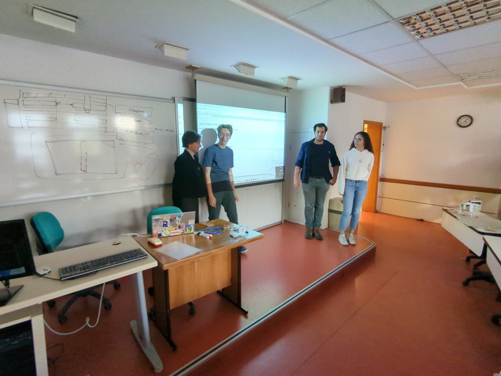 -->
<!--  -->
<!-- 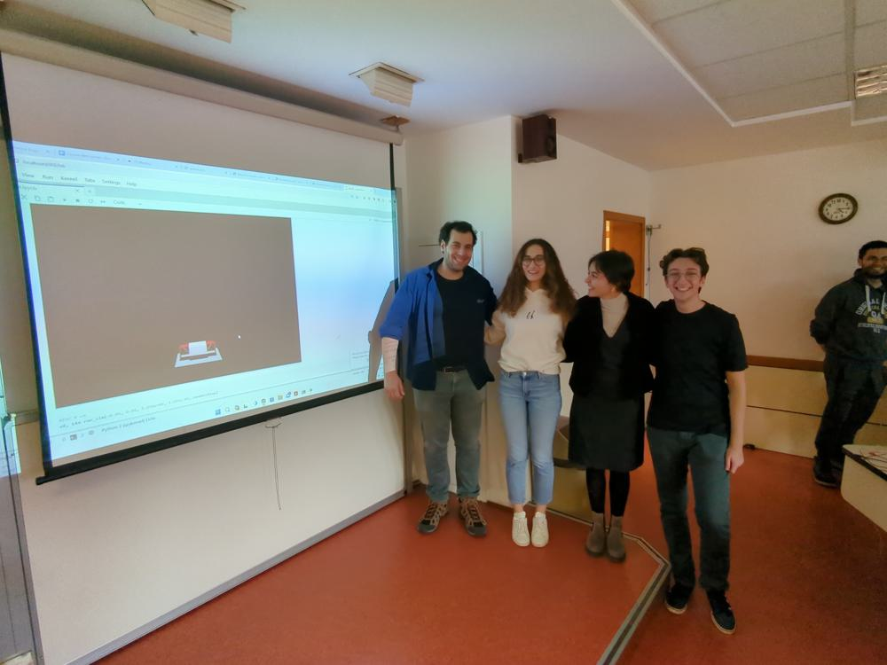 -->
<!--  -->
<!-- 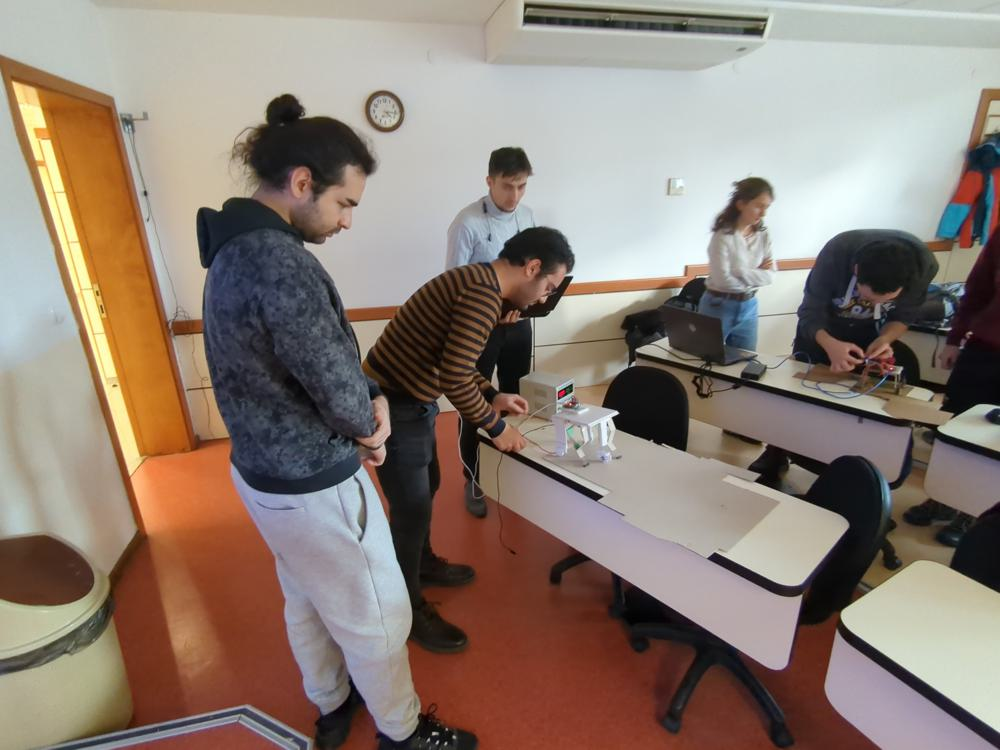 -->
<!-- 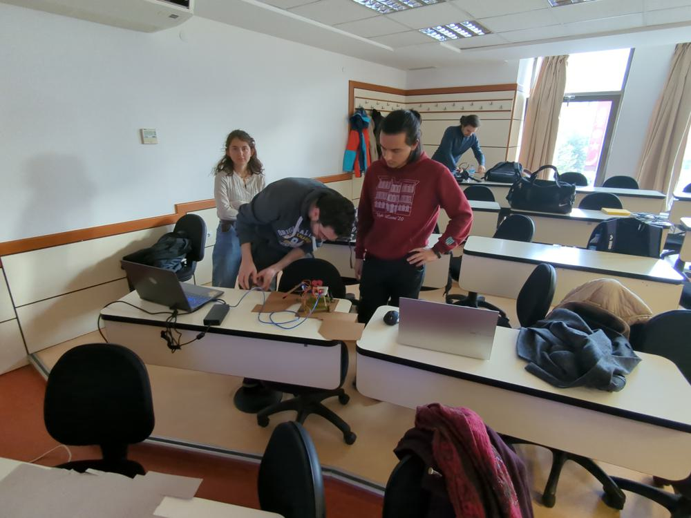 -->

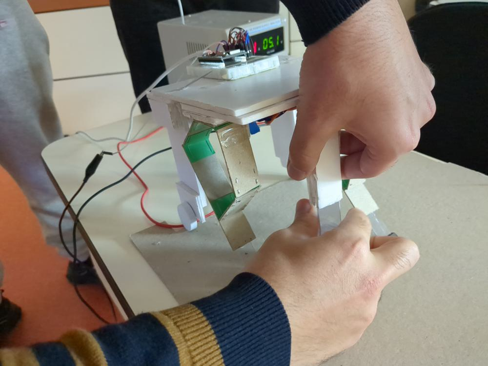
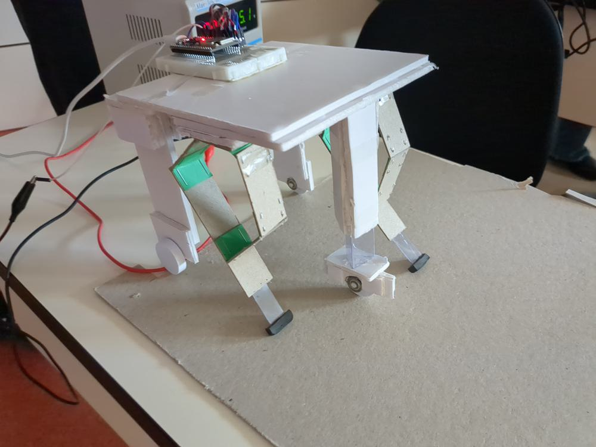

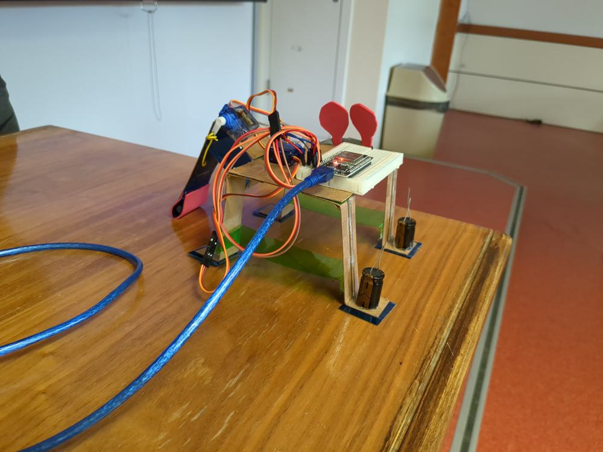
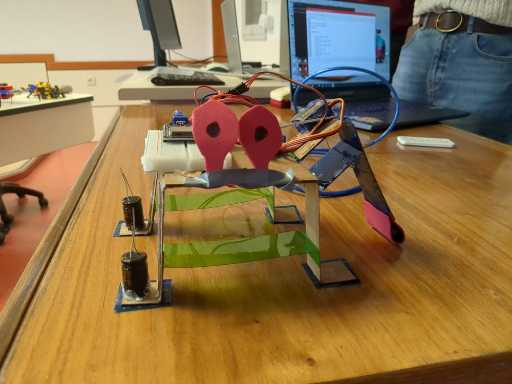
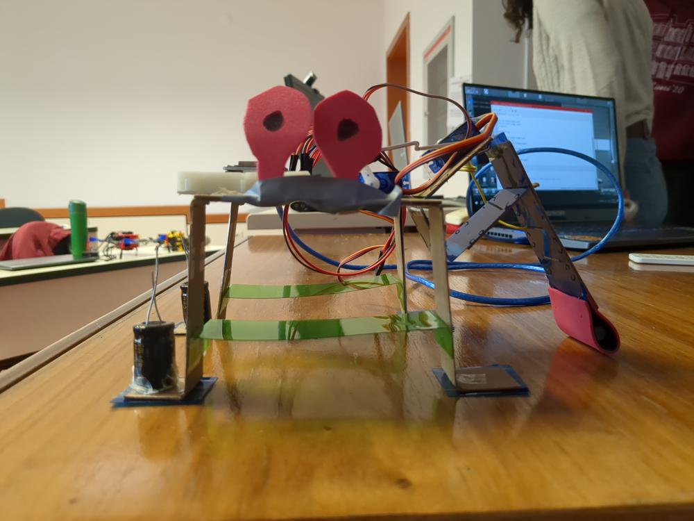
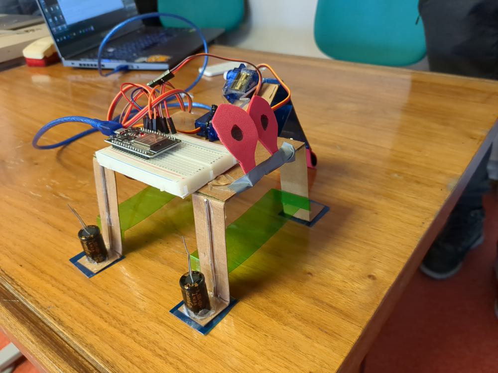
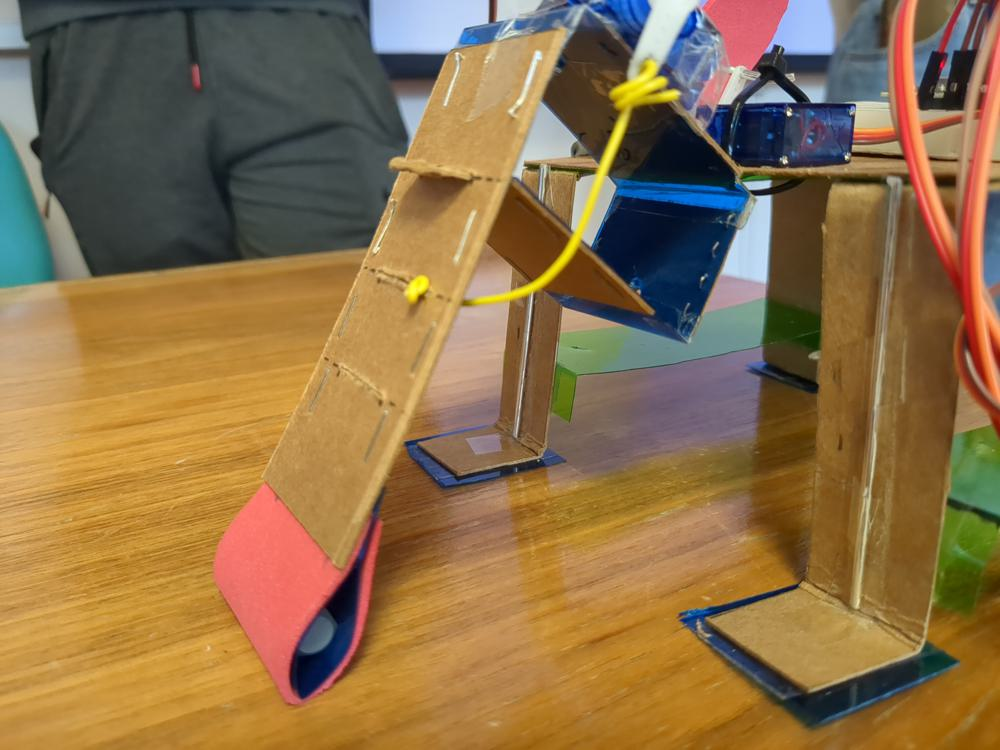
<!-- 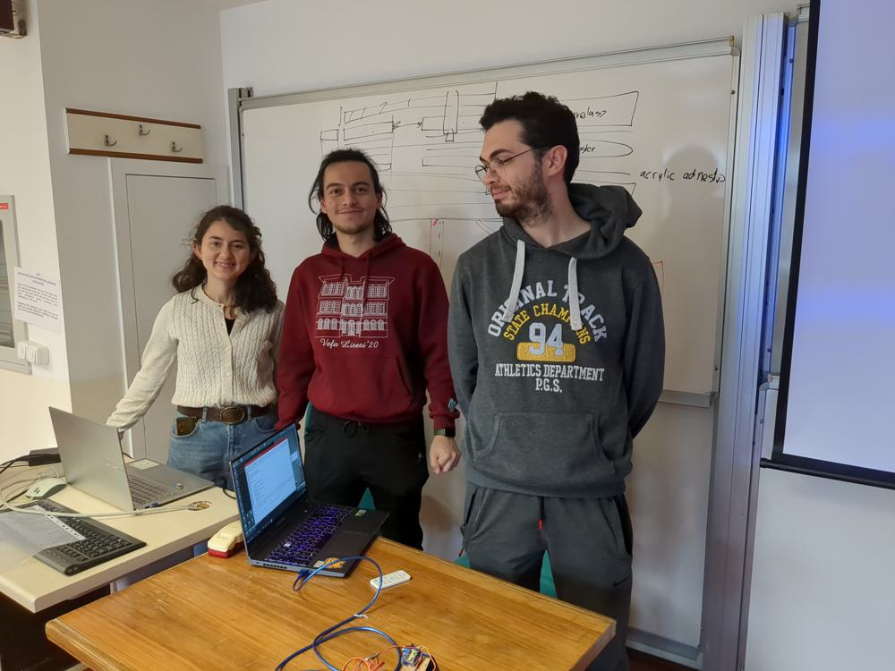 -->
<!-- 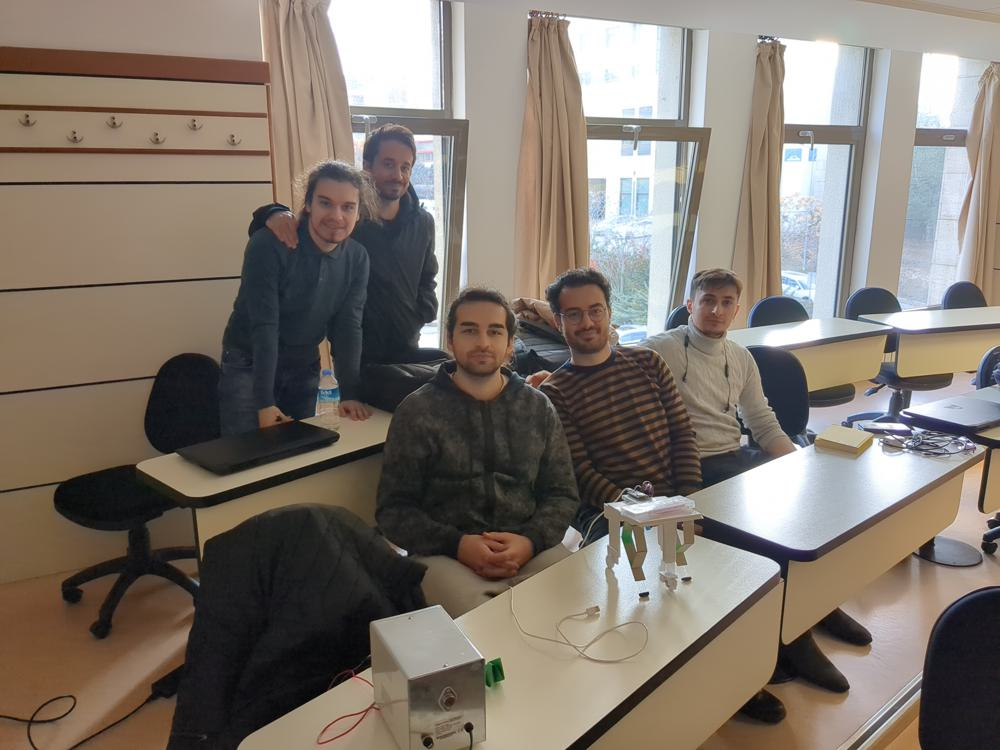 -->

<!--  -->

<!-- ## Videos -->

<video src="VID_20231214_161654-2.mp4" controls title="Title" style="width:100%;"></video>

<video src="VID_20231214_162300.mp4" controls title="Title" style="width:100%;"></video>

<video src="VID_20231214_163923.mp4" controls title="Title" style="width:100%;"></video>

<!-- <video src="VID_20231214_161916.mp4" controls title="Title" style="height:200px;"></video> -->
<!-- <video src="VID_20231214_162117.mp4" controls title="Title" style="height:200px;"></video> -->
<!-- <video src="VID_20231214_162201.mp4" controls title="Title" style="height:200px;"></video> -->
<!-- <video src="VID_20231214_163614.mp4" controls title="Title" style="height:200px;"></video> -->
