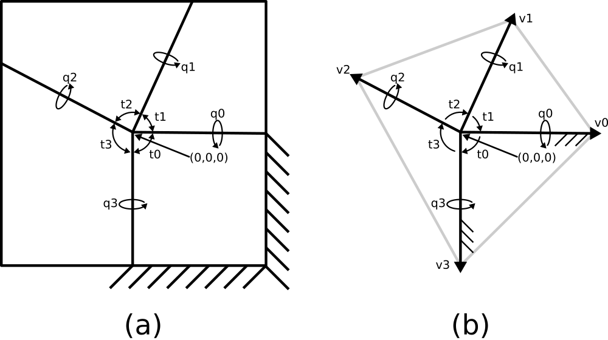

{width=50%}

## Instructions

1. Imagine a flat piece of paper(black lines) folded with four lines that meet in the center.  the angles $t_0$, $t_1$,$t_2$, and $t_3$ define the angles between each line.
    * pick your own values for $t_i$, as long as none of the hinges are co-linear when flat.
    * what do the angles $t_0, t_1,t_2,$ and $t_3$ sum up to?  Is that constant?
1. Fold a piece of paper to match the values of t you picked.  Play with it to get a physical sense of the kinematics.  Try not to let the "links" bend, only the "hinges", to get a sense of the rigid kinematics.
    * Which are the mountain folds and which are the valley folds?  Are there multiple answers?  Pick one configuration to answer the rest of this homework.
    * Include 2 pictures of your mechanism: one flattened, and one of it erected into a 3d shape.
    * Plot the piece of paper in 2d in Python, using red for mountain folds and blue for valley folds.
1. What remains constant as this mechanism moves in space?  What changes?  Answer with respect to $t_i, q_j,$ and $v_k$.
1. Create the kinematic constraint equations that describe this mechanism's motion, using the four-bar exercise from class as a starting point, and using $q_0$ as an input angle.  
    * What about the code has to change?
    * Any new equation types?
    * it may be helpful to think of your paper mechanism as a set of unit-length vectors(fig 1b) rather than polygons, to make it easier to think about(and plot).
    * **optional:** Referring to Figure 2, is there something other than $t_i$ which would work just as well in a constraint equation?
    * What happens when you try to solve with all the vectors starting in the xy plane?
1. Pick an initial "guess" for your mechanism so that none of the folds are exactly on the x-y plane.  It will be useful to use the mountain/valley designation you specified earlier to "seed" your initial guess with a positive/negative z value.
    * Solve the equations using the scipy.optimize.minimize function,
    * Show the output of the minimize function to ensure it solved correctly (error is near zero).  The output should contain variable indicating final error.
    ```{python}
    result  = scipy.optimize.minimize(minimization_function,initial_values)
    print(result.fun)
    ```
1. Plot the motion(several configurations) of your device as $q_0$ changes.  Only plot valid configurations
    * It may be useful to use the guess from the previously-solved iteration as an initial guess for the next iteration.
    * plot in 3d.
    * **optional:** Instead of hard-coding how you color mountain-valley lines, can you alter your program to dynamically plot hinge line colors based on the solver results?

## Submission

In a pdf:

* Answer any questions and discussion
* Include all renderings, plots and photos

Separately:

* include code, either as a .py  or .ipynb file.
* if you use jupyter notebook, you can submit the **just** the notebook file, by using markup to include answers, discussion, and images(using html `````` tags).
